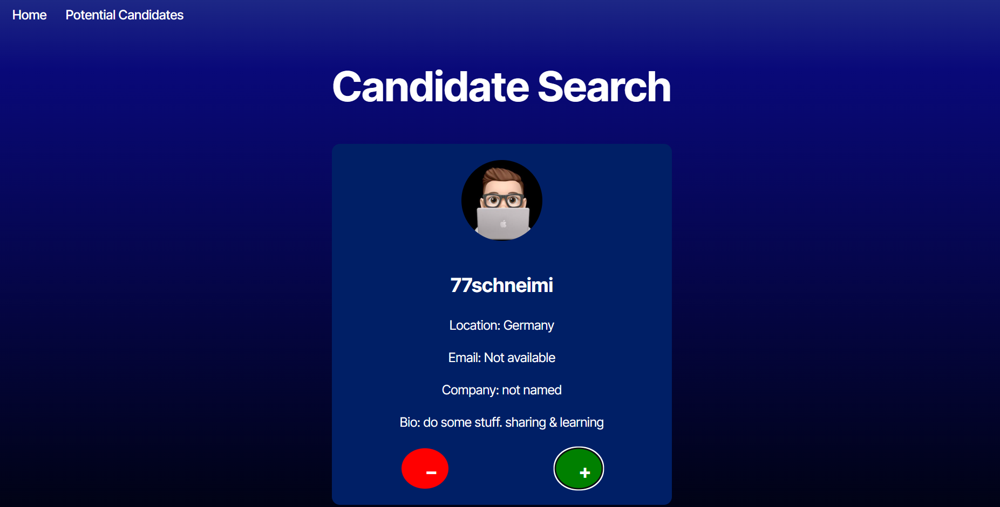
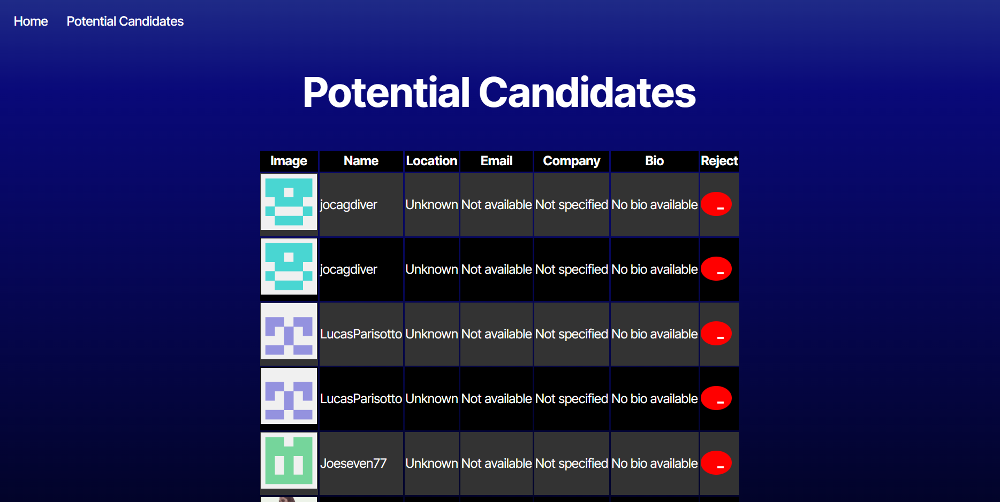

# Candidate Search


## Description 
Candidate Search is a web application that allows users to search for GitHub users and save potential candidates for future reference. The application fetches random GitHub users and displays their profile information, including their avatar, username, location, email, company, and bio. Users can save or reject candidates, and view their saved candidates in a separate section.


## Installation

1. Clone the repository:
   ```sh
   git clone https://github.com/your-username/candidate-search.git
   cd candidate-search
   ```

2. Install dependencies:
   ```sh
   npm install
   ```

3. Create a `.env` file in the `environment` directory with your GitHub token:
   ```
   VITE_GITHUB_TOKEN=your_github_token
   ```


## License

This project is licensed under the MIT License. See the [LICENSE](LICENSE) file for details.
<br><br>

## Deployed Link

You can view the deployed application [here](https://candidatesearch-0ngz.onrender.com).


<br><br>



